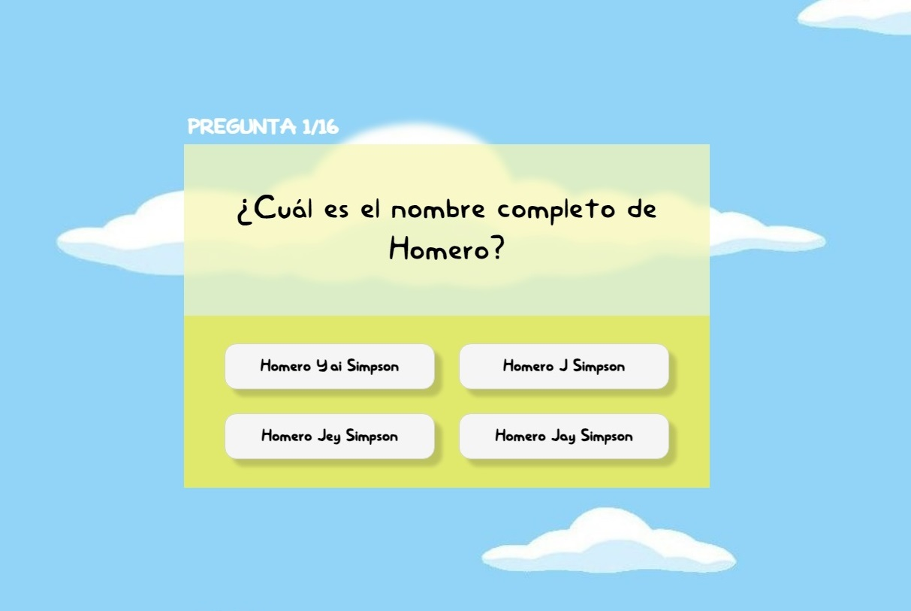

# Hi 👋 i'm Edgardo Silva!

Web programmer, lover of programming 💻, music 🎸 and sports ⚽. Check out my profile and see the projects I'm working on!

## Skills 🧑🏽‍💻

 

## Featured projects 🛠️

### Simpsons React Quiz

Welcome to the Simpsons Quiz App, a fun and interactive quiz application built with React.js and powered by Firebase. Test your knowledge of the iconic Simpsons TV show with this engaging quiz that covers a wide range of trivia from Springfield.

## 
Thank you for visiting my profile!

